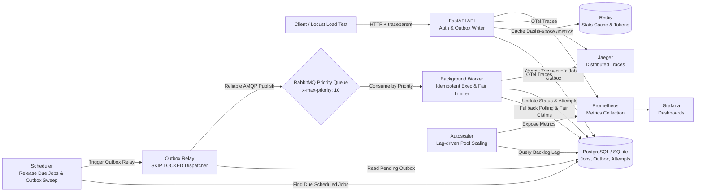

# Distributed Task Platform

A FastAPI-based distributed job processing platform with authentication, scheduled jobs, background workers, retry handling, job attempt history, health checks, and Prometheus metrics.

## Overview

This project lets authenticated users create jobs that are processed asynchronously by background workers. Jobs can run immediately or at a scheduled time, and failed jobs can be retried until they reach a dead-letter state.

The system includes:

- JWT-based authentication
- job creation and listing APIs
- background job processing
- delayed job scheduling
- retry and dead-letter handling
- per-attempt job history
- dashboard stats with cache support
- health, readiness, and metrics endpoints
- SQLite for local development and PostgreSQL for Docker
- optional RabbitMQ and Redis integration

## Architecture

The platform is split into a few core processes:

- **FastAPI API** for authentication and job management
- **Worker** for consuming and processing jobs
- **Scheduler** for releasing delayed jobs when they become due
- **Database** for storing users, jobs, and job attempts
- **Queue** for dispatching jobs when RabbitMQ is enabled
- **Cache** for short-lived dashboard stats

High-level flow:

1. A user registers or logs in.
2. The user creates a job through the API.
3. The job is stored in the database.
4. If the job is ready to run, it is queued.
5. A worker claims the job and processes the payload.
6. The job is marked `completed`, `retrying`, or `dead_letter`.
7. Every attempt is stored in `job_attempts`.

### Architecture Diagram



RabbitMQ and Redis are optional for local development. RabbitMQ provides
message-based job delivery, while Redis caches dashboard statistics. When
RabbitMQ is disabled, the worker falls back to polling the database for queued
jobs; when Redis is disabled, dashboard statistics are read directly from the
database. The Docker Compose stack enables both services for a production-like
setup. PostgreSQL is used by Docker Compose, while SQLite is supported for local
development.

## Features

- **Transactional Outbox Pattern**: Eliminates dual-write anomalies by atomically saving jobs and outbox events in a single database transaction, asynchronously dispatched to RabbitMQ via `SELECT ... FOR UPDATE SKIP LOCKED`.
- **Priority Queues (1–10)**: Strict prioritization with RabbitMQ `x-max-priority: 10` and database fallback indexing.
- **Fair Multi-Tenant Concurrency Limits**: Per-tenant concurrency caps (`MAX_CONCURRENT_JOBS_PER_TENANT`) isolate noisy neighbors and prevent queue starvation.
- **Worker Execution Idempotency**: Guard against duplicate side effects during at-least-once AMQP redeliveries.
- **Distributed Tracing (OpenTelemetry + Jaeger)**: Cross-service span context propagation across HTTP headers, database queries, and RabbitMQ message headers.
- **Automated Worker Autoscaler**: Backlog-aware dynamic scaling calculations (`autoscaler.py`).
- **Locust Load Testing Suite**: Realistic multi-tenant stress tests measuring throughput, p95/p99 latency, and saturation.
- **Chaos Engineering & Resilience**: Automated failure-injection tests validating recovery from broker outages, crashed worker pods, and poison pills.
- **Self-Healing Orphan Reclamation**: Background recovery of zombie jobs abandoned by crashed worker pods.
- **Observability**: Prometheus metrics, health & readiness endpoints, and Grafana monitoring dashboards.
- **Production Containerization**: Full multi-container Docker Compose topology (API, Workers, Scheduler, Postgres, Redis, RabbitMQ, Jaeger, Prometheus, Grafana).

## Tech Stack

- Python 3.10+
- FastAPI & Uvicorn
- SQLAlchemy 2.0 & Alembic
- PostgreSQL & SQLite
- RabbitMQ & Redis
- OpenTelemetry SDK & Jaeger
- Prometheus & Grafana
- Locust (Load Testing)
- Pytest (Unit, Integration & Chaos Tests)

## Project Structure

```txt
app/
  broker.py       # RabbitMQ publisher & consumer with priority support
  cache.py        # Redis caching layer
  config.py       # Pydantic v2 application settings
  database.py     # SQLAlchemy engine & session factory
  dependencies.py # Auth & DB dependency injection
  main.py         # FastAPI application entrypoint with OTel instrumentation
  models.py       # User, Job, JobAttempt, OutboxEvent models
  observability.py# Prometheus metrics & exporter
  outbox.py       # Transactional Outbox engine & SKIP LOCKED relay
  routers/        # Auth, Jobs, Health REST endpoints
  schemas.py      # Pydantic v2 request/response contracts
  security.py     # JWT & password hashing
  services.py     # Job lifecycle, concurrency control & fair scheduler
  tracing.py      # OpenTelemetry provider & W3C context propagation
worker.py         # Background worker with execution idempotency guard
scheduler.py      # Delayed job release & orphan recovery engine
autoscaler.py     # Queue lag dynamic worker autoscaler
load_tests/       # Locust performance & load testing suite
docs/
  architecture.md # Deep-dive architectural specification
  failure_recovery.md # Disaster Recovery & Failure Modes runbook
monitoring/       # Prometheus scrape configuration
grafana/          # Provisioned monitoring dashboards
tests/            # Unit, integration, and chaos test suites
```

## Setup

### Prerequisites

- Python 3.10 or newer
- Node.js is not required for this backend
- Docker and Docker Compose optional

### Local install

```bash
python -m venv .venv
.venv\Scripts\Activate.ps1
pip install -r requirements.txt
```

Create environment settings:

```bash
Copy-Item .env.example .env
```

## Environment Variables

The main configuration values are:

- `DATABASE_URL` - SQLAlchemy database URL
- `REDIS_URL` - Redis connection string
- `RABBITMQ_URL` - RabbitMQ connection string
- `JWT_SECRET_KEY` - secret used to sign JWT tokens
- `ACCESS_TOKEN_EXPIRE_MINUTES` - access token lifetime
- `REFRESH_TOKEN_EXPIRE_DAYS` - refresh token lifetime
- `WORKER_POLL_INTERVAL_SECONDS` - polling interval in database mode
- `SCHEDULER_POLL_INTERVAL_SECONDS` - delayed job scan interval
- `RETRY_DELAY_SECONDS` - delay before a failed job is retried
- `MAX_JOB_ATTEMPTS` - maximum retry count
- `QUEUE_NAME` - default queue name
- `ENABLE_RABBITMQ` - enable RabbitMQ publishing/consumption
- `ENABLE_REDIS` - enable Redis cache
- `AUTO_CREATE_TABLES` - create tables on startup
- `METRICS_NAMESPACE` - prefix for Prometheus metrics

## Running the API

Start the API:

```bash
uvicorn app.main:app --reload --host 0.0.0.0 --port 8000
```

API docs:

- Swagger UI: `http://localhost:8000/docs`
- ReDoc: `http://localhost:8000/redoc`

## Running the Worker

Start the worker in a separate terminal:

```bash
python worker.py
```

If RabbitMQ is disabled, the worker falls back to polling the database for queued jobs.

## Running the Scheduler

Start the scheduler in another terminal:

```bash
python scheduler.py
```

The scheduler moves due delayed jobs from `scheduled` to `queued`.

## Docker

Start the full stack:

```bash
docker compose up --build
```

Typical services exposed by the compose file:

- API on `8000`
- PostgreSQL on `5432`
- Redis on `6379`
- RabbitMQ management UI on `15672`
- Jaeger Tracing UI on `16686` (OTLP on `4317`/`4318`)
- Prometheus on `9090`
- Grafana on `3000`

## API Endpoints

### Health

- `GET /`
- `GET /health`
- `GET /ready`
- `GET /metrics`

### Auth

- `POST /auth/register`
- `POST /auth/login`
- `GET /auth/me`

### Jobs

- `POST /jobs`
- `GET /jobs`
- `GET /jobs/{job_id}`
- `GET /jobs/{job_id}/attempts`
- `POST /jobs/{job_id}/retry`
- `GET /jobs/dashboard/stats`

## Authentication

Protected endpoints require a bearer access token.

Example:

```bash
Authorization: Bearer <access_token>
```

## Job Payload Examples

### Sum numbers

```json
{
  "job_type": "math",
  "payload": {
    "action": "sum",
    "numbers": [1, 2, 3]
  }
}
```

### Uppercase text

```json
{
  "job_type": "transform",
  "payload": {
    "action": "uppercase",
    "value": "hello"
  }
}
```

### Simulate failure

```json
{
  "job_type": "failure-test",
  "payload": {
    "action": "fail",
    "message": "boom"
  }
}
```

### Schedule a job

```json
{
  "job_type": "scheduled",
  "run_at": "2026-07-10T18:30:00Z",
  "payload": {
    "action": "sleep",
    "seconds": 5
  }
}
```

### Idempotent job with correlation tracking

```json
{
  "job_type": "math",
  "idempotency_key": "payment-tx-94812",
  "correlation_id": "req-trace-41829a",
  "payload": {
    "action": "sum",
    "numbers": [100, 250, 75]
  }
}
```

## Job States

- `queued`
- `scheduled`
- `running`
- `retrying`
- `completed`
- `dead_letter`

## Testing & Chaos Engineering

Run the complete test suite (18 automated tests across unit, integration, and chaos suites):

```bash
python -m pytest
```

### Test Suite Structure

1. **Unit & API Integration Tests (`tests/test_job_platform.py`)**:
   - Authentication registration and JWT token round-trip
   - Job lifecycle state machine (queued $\rightarrow$ running $\rightarrow$ completed / dead_letter)
   - Per-attempt execution history auditing
   - Active job retry rejection (409 Conflict)
   - **Transactional Outbox Event Creation & Relay** (atomic DB persistence + AMQP dispatch)
   - **Priority Queue Scheduling** (jobs processed strictly in priority 10 $\rightarrow$ 1 order)
   - **Multi-Tenant Concurrency Fairness** (noisy neighbor isolation when tenant caps are hit)
   - **Worker Execution Idempotency** (ignoring redelivered tasks already completed)
   - **OpenTelemetry Tracing Helpers** (trace context injection and span creation)

2. **Chaos Engineering & Failure-Injection Tests (`tests/test_chaos_failure_injection.py`)**:
   - **Crashed Worker Mid-Task**: Abrupt worker death (`SIGKILL`) $\rightarrow$ self-healing orphan recovery re-enqueues job.
   - **Broker Outage Buffer**: RabbitMQ outage $\rightarrow$ outbox tables buffer jobs in DB $\rightarrow$ full recovery upon broker restart.
   - **Poison Pill Payload Isolation**: Malformed task payloads are isolated to DLQ without crashing the worker process.
   - **Tenant Saturation**: Queue flooding is throttled per tenant so normal tenants receive timely execution.
   - **Autoscaler Scaling Calculations**: Backlog spikes dynamically compute proportional worker capacity.

3. **Performance & Load Testing (`load_tests/`)**:
   - See [load_tests/README.md](load_tests/README.md) for running Locust benchmarks.

4. **Failure Recovery Runbooks (`docs/failure_recovery.md`)**:
   - See [docs/failure_recovery.md](docs/failure_recovery.md) for incident runbooks and architecture failure modes.

## Observability

The project exposes Prometheus metrics for:

- jobs created
- jobs completed
- jobs failed
- jobs retried
- active workers
- queue length
- job processing duration

## Notes

- SQLite is used by default for local development.
- PostgreSQL is the preferred database for Docker and deployment.
- Redis is recommended for dashboard-stat caching in production and can be disabled locally.
- RabbitMQ is recommended for scalable message-based job delivery; the worker can poll the database as a local-development fallback.
