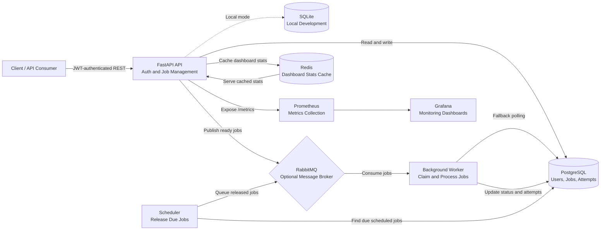

# Distributed Task Platform

A FastAPI-based distributed job processing platform with authentication, scheduled jobs, background workers, retry handling, job attempt history, health checks, and Prometheus metrics.

## Overview

This project lets authenticated users create jobs that are processed asynchronously by background workers. Jobs can run immediately or at a scheduled time, and failed jobs can be retried until they reach a dead-letter state.

The system includes:

- JWT-based authentication
- job creation and listing APIs
- background job processing
- delayed job scheduling
- retry and dead-letter handling
- per-attempt job history
- dashboard stats with cache support
- health, readiness, and metrics endpoints
- SQLite for local development and PostgreSQL for Docker
- optional RabbitMQ and Redis integration

## Architecture

The platform is split into a few core processes:

- **FastAPI API** for authentication and job management
- **Worker** for consuming and processing jobs
- **Scheduler** for releasing delayed jobs when they become due
- **Database** for storing users, jobs, and job attempts
- **Queue** for dispatching jobs when RabbitMQ is enabled
- **Cache** for short-lived dashboard stats

High-level flow:

1. A user registers or logs in.
2. The user creates a job through the API.
3. The job is stored in the database.
4. If the job is ready to run, it is queued.
5. A worker claims the job and processes the payload.
6. The job is marked `completed`, `retrying`, or `dead_letter`.
7. Every attempt is stored in `job_attempts`.

### Architecture Diagram



RabbitMQ and Redis are optional for local development. RabbitMQ provides
message-based job delivery, while Redis caches dashboard statistics. When
RabbitMQ is disabled, the worker falls back to polling the database for queued
jobs; when Redis is disabled, dashboard statistics are read directly from the
database. The Docker Compose stack enables both services for a production-like
setup. PostgreSQL is used by Docker Compose, while SQLite is supported for local
development.

## Features

- **User Authentication**: JWT access and refresh tokens with bcrypt password hashing
- **Job Orchestration**: Authenticated job creation, filtering, status tracking, and pagination
- **Idempotent Job Creation**: Client-provided `idempotency_key` guarantees safe network retries without duplicate executions
- **Distributed Concurrency Control**: PostgreSQL `SELECT ... FOR UPDATE SKIP LOCKED` (and atomic CAS update fallback) prevents double-claiming race conditions across workers
- **Self-Healing Orphan Recovery**: Periodic scan automatically recovers tasks abandoned by crashed worker pods/processes
- **End-to-End Distributed Tracing**: Unique `correlation_id` propagated across API $\rightarrow$ Database $\rightarrow$ RabbitMQ $\rightarrow$ Worker attempt logs
- **Graceful Worker Shutdown**: Signal trapping (`SIGTERM`, `SIGINT`) allows active jobs to finish cleanly before process termination
- **Delayed & Scheduled Execution**: Timestamp-based deferred task execution (`run_at`) managed by a dedicated scheduler service
- **Fault Tolerance**: Automatic retries with exponential backoff delay and Dead-Letter Queue (DLQ) state machine
- **Audit Logging**: Per-attempt execution log capturing worker ID, timestamps, status, and error traces
- **Observability**: Prometheus metrics, health & readiness endpoints, and Grafana monitoring dashboards
- **Hybrid Architecture**: SQLite for local lightweight development, PostgreSQL + Redis + RabbitMQ for production Docker deployment

## Tech Stack

- Python 3.10+
- FastAPI
- SQLAlchemy
- Pydantic v2
- PostgreSQL
- SQLite
- Redis
- RabbitMQ
- Prometheus client

## Project Structure

```txt
app/
  main.py
  routers/
  services.py
  models.py
  schemas.py
  worker.py
  scheduler.py
tests/
alembic/
monitoring/
grafana/
```

## Setup

### Prerequisites

- Python 3.10 or newer
- Node.js is not required for this backend
- Docker and Docker Compose optional

### Local install

```bash
python -m venv .venv
.venv\Scripts\Activate.ps1
pip install -r requirements.txt
```

Create environment settings:

```bash
Copy-Item .env.example .env
```

## Environment Variables

The main configuration values are:

- `DATABASE_URL` - SQLAlchemy database URL
- `REDIS_URL` - Redis connection string
- `RABBITMQ_URL` - RabbitMQ connection string
- `JWT_SECRET_KEY` - secret used to sign JWT tokens
- `ACCESS_TOKEN_EXPIRE_MINUTES` - access token lifetime
- `REFRESH_TOKEN_EXPIRE_DAYS` - refresh token lifetime
- `WORKER_POLL_INTERVAL_SECONDS` - polling interval in database mode
- `SCHEDULER_POLL_INTERVAL_SECONDS` - delayed job scan interval
- `RETRY_DELAY_SECONDS` - delay before a failed job is retried
- `MAX_JOB_ATTEMPTS` - maximum retry count
- `QUEUE_NAME` - default queue name
- `ENABLE_RABBITMQ` - enable RabbitMQ publishing/consumption
- `ENABLE_REDIS` - enable Redis cache
- `AUTO_CREATE_TABLES` - create tables on startup
- `METRICS_NAMESPACE` - prefix for Prometheus metrics

## Running the API

Start the API:

```bash
uvicorn app.main:app --reload --host 0.0.0.0 --port 8000
```

API docs:

- Swagger UI: `http://localhost:8000/docs`
- ReDoc: `http://localhost:8000/redoc`

## Running the Worker

Start the worker in a separate terminal:

```bash
python worker.py
```

If RabbitMQ is disabled, the worker falls back to polling the database for queued jobs.

## Running the Scheduler

Start the scheduler in another terminal:

```bash
python scheduler.py
```

The scheduler moves due delayed jobs from `scheduled` to `queued`.

## Docker

Start the full stack:

```bash
docker compose up --build
```

Typical services exposed by the compose file:

- API on `8000`
- PostgreSQL on `5432`
- Redis on `6379`
- RabbitMQ management UI on `15672`
- Prometheus on `9090`
- Grafana on `3000`

## API Endpoints

### Health

- `GET /`
- `GET /health`
- `GET /ready`
- `GET /metrics`

### Auth

- `POST /auth/register`
- `POST /auth/login`
- `GET /auth/me`

### Jobs

- `POST /jobs`
- `GET /jobs`
- `GET /jobs/{job_id}`
- `GET /jobs/{job_id}/attempts`
- `POST /jobs/{job_id}/retry`
- `GET /jobs/dashboard/stats`

## Authentication

Protected endpoints require a bearer access token.

Example:

```bash
Authorization: Bearer <access_token>
```

## Job Payload Examples

### Sum numbers

```json
{
  "job_type": "math",
  "payload": {
    "action": "sum",
    "numbers": [1, 2, 3]
  }
}
```

### Uppercase text

```json
{
  "job_type": "transform",
  "payload": {
    "action": "uppercase",
    "value": "hello"
  }
}
```

### Simulate failure

```json
{
  "job_type": "failure-test",
  "payload": {
    "action": "fail",
    "message": "boom"
  }
}
```

### Schedule a job

```json
{
  "job_type": "scheduled",
  "run_at": "2026-07-10T18:30:00Z",
  "payload": {
    "action": "sleep",
    "seconds": 5
  }
}
```

### Idempotent job with correlation tracking

```json
{
  "job_type": "math",
  "idempotency_key": "payment-tx-94812",
  "correlation_id": "req-trace-41829a",
  "payload": {
    "action": "sum",
    "numbers": [100, 250, 75]
  }
}
```

## Job States

- `queued`
- `scheduled`
- `running`
- `retrying`
- `completed`
- `dead_letter`

## Testing

Run the test suite:

```bash
python -m pytest
```

The test suite covers:

- Authentication registration and login round-trip
- Full job lifecycle (queued $\rightarrow$ running $\rightarrow$ dead_letter / completed)
- Per-attempt execution history auditing
- Active job retry prevention (409 Conflict)
- Retry and delayed schedule flows
- **Idempotency key deduplication** (duplicate submissions safely return existing job)
- **Correlation ID distributed tracing propagation**
- **Self-healing orphaned job recovery** under worker crashes

## Observability

The project exposes Prometheus metrics for:

- jobs created
- jobs completed
- jobs failed
- jobs retried
- active workers
- queue length
- job processing duration

## Notes

- SQLite is used by default for local development.
- PostgreSQL is the preferred database for Docker and deployment.
- Redis is recommended for dashboard-stat caching in production and can be disabled locally.
- RabbitMQ is recommended for scalable message-based job delivery; the worker can poll the database as a local-development fallback.
