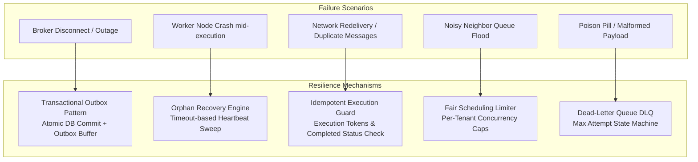

# Disaster Recovery & Failure Modes Runbook

This document details the failure scenarios, resilience mechanisms, and operational recovery procedures for the **Distributed Task Platform**.

---

## 1. Resilience Architecture Overview

The system is designed with a **zero-data-loss, self-healing philosophy** across network partitions, node crashes, and service outages.



---

## 2. Failure Scenarios & Mitigation Strategies

### Scenario 1: RabbitMQ Broker Downtime (Dual-Write Protection)
* **Risk**: If the API writes a job to PostgreSQL but RabbitMQ is unreachable or down, a direct-publish approach loses the message or fails the client request.
* **Mitigation (Transactional Outbox Pattern)**:
  1. The API commits both the `Job` record and an `OutboxEvent` record atomically inside the *same* database transaction.
  2. If RabbitMQ is down, the outbox record remains in `status="pending"`.
  3. The `relay_outbox_events()` engine periodically attempts delivery with exponential backoff and tracks `retry_count`.
  4. Once RabbitMQ is restored, all buffered events are dispatched in FIFO order without duplicate loss.
* **Verification**: Verified in `tests/test_chaos_failure_injection.py::test_chaos_broker_outage_buffered_by_outbox`.

---

### Scenario 2: Worker Process / Pod Crash mid-execution (Zombie Recovery)
* **Risk**: A worker claims a task, marks it `running`, and crashes abruptly (`SIGKILL`, OOM, node reboot) before acknowledging or updating status.
* **Mitigation (Self-Healing Orphan Reclamation)**:
  1. Each running job records `started_at` and `worker_id`.
  2. The `recover_orphaned_jobs()` process (executed on every scheduler tick) sweeps for tasks stuck in `running` status beyond `timeout_minutes` (default 30m).
  3. Orphaned tasks have an error logged in `job_attempts`, their retry counter incremented, and are transitioned to `retrying` (with backoff delay) or `dead_letter`.
  4. Healthy workers subsequently re-claim the task.
* **Verification**: Verified in `tests/test_chaos_failure_injection.py::test_chaos_crashed_worker_orphan_recovery`.

---

### Scenario 3: At-Least-Once Redelivery (Duplicate Execution Guard)
* **Risk**: RabbitMQ redelivers a task message because an ACK was delayed or a network connection dropped right after the worker finished payload execution.
* **Mitigation (Worker Execution Idempotency)**:
  1. Before executing `process_payload()`, the worker checks whether `job.status == "completed"`.
  2. If completed, the worker logs a warning, skips redundant execution, and acknowledges the message immediately.
  3. Prevents duplicate charges, double DB writes, or external API side effects.
* **Verification**: Verified in `tests/test_job_platform.py::test_worker_idempotent_execution_guard`.

---

### Scenario 4: Noisy Neighbor / Tenant Flooding (Fair Queuing)
* **Risk**: A single tenant submits 50,000 tasks simultaneously, starving other users.
* **Mitigation (Tenant Concurrency Limits + Priority Queues)**:
  1. Each tenant is subject to `MAX_CONCURRENT_JOBS_PER_TENANT` (default 5 concurrent running tasks).
  2. When a worker claims work, it checks `active_tenant_jobs = count(Job.owner_id == candidate.owner_id and status == 'running')`.
  3. If the tenant is saturated, the worker skips to candidate jobs belonging to other tenants.
  4. RabbitMQ queues prioritize high-value tasks (`x-max-priority: 10`).
* **Verification**: Verified in `tests/test_chaos_failure_injection.py::test_chaos_noisy_neighbor_concurrency_isolation`.

---

### Scenario 5: Poison Pill / Malformed Payloads
* **Risk**: A job payload triggers an unhandled crash or syntax error, which could crash the worker in a death-loop.
* **Mitigation (Isolated Execution & DLQ Transition)**:
  1. The worker wraps payload execution in structured exception trapping.
  2. The error message and stack trace are persisted to `JobAttempt.error_message`.
  3. If `attempts >= max_attempts`, the job transitions to `dead_letter` and stops retrying.
  4. The worker remains online and processes the next task.
* **Verification**: Verified in `tests/test_chaos_failure_injection.py::test_chaos_poison_pill_payload_isolation`.

---

## 3. Operational Runbooks

### Runbook A: Inspecting Distributed Traces in Jaeger
1. Open the Jaeger UI at `http://localhost:16686`.
2. Select Service: `dtp-api` or `dtp-worker`.
3. Search for traces or paste the `correlation_id` in the search tags: `correlation_id=<uuid>`.
4. Inspect the flame graph:
   - Span 1: `api.create_job` (HTTP request lifecycle)
   - Span 2: `outbox.publish_event` (DB transaction and AMQP publish)
   - Span 3: `worker.process_job` (Worker claim, context extraction, and payload execution duration)

### Runbook B: Replaying Dead-Lettered Tasks
To replay jobs that ended up in `dead_letter` after fixing a bug or upstream dependency:
```bash
# Call the retry API endpoint with a bearer token
curl -X POST "http://localhost:8000/jobs/<job-id>/retry" \
  -H "Authorization: Bearer <token>" \
  -H "Content-Type: application/json" \
  -d '{"delay_seconds": 0}'
```

### Runbook C: Monitoring Queue Backlog & Scaling Workers
1. Open Grafana at `http://localhost:3000` (credentials: `admin` / `admin`).
2. Check the `Queue Length` panel and `Desired Workers` metric.
3. Scale workers manually via Docker Compose if desired:
   ```bash
   docker compose up -d --scale worker=4
   ```
